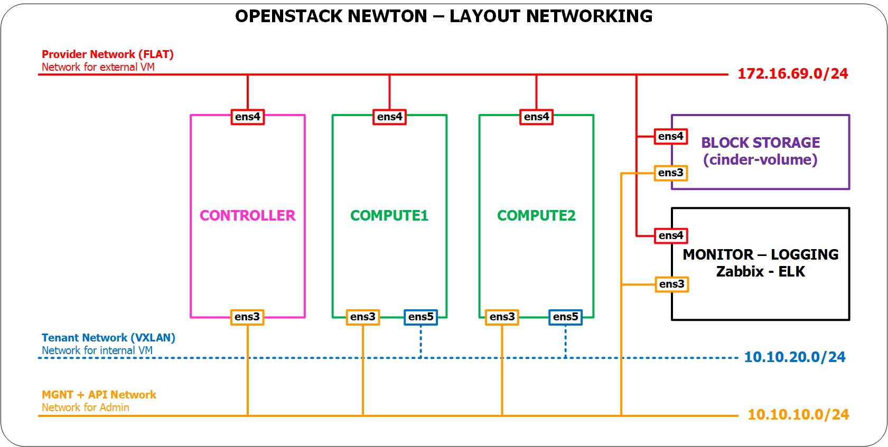
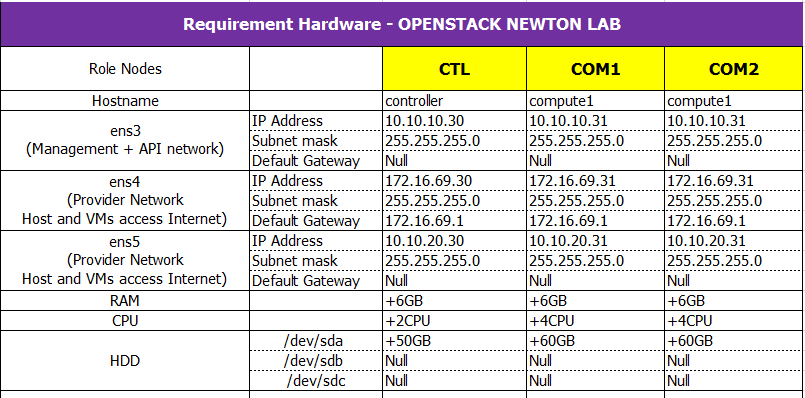
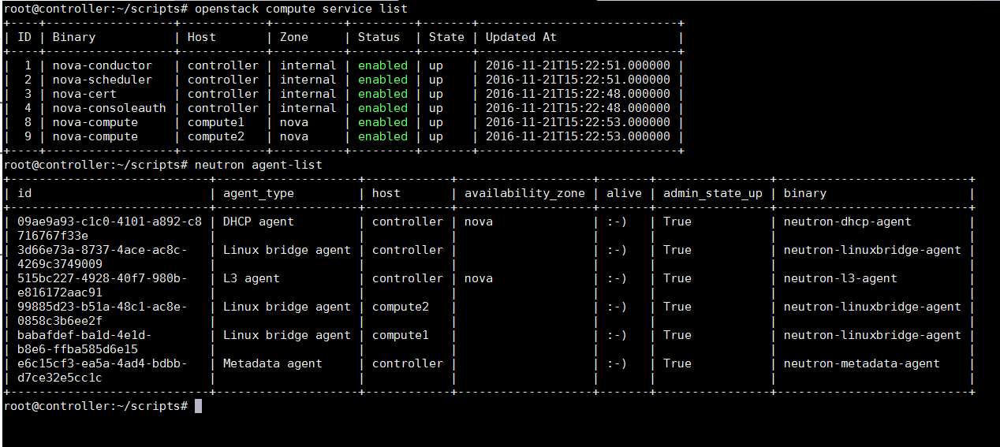
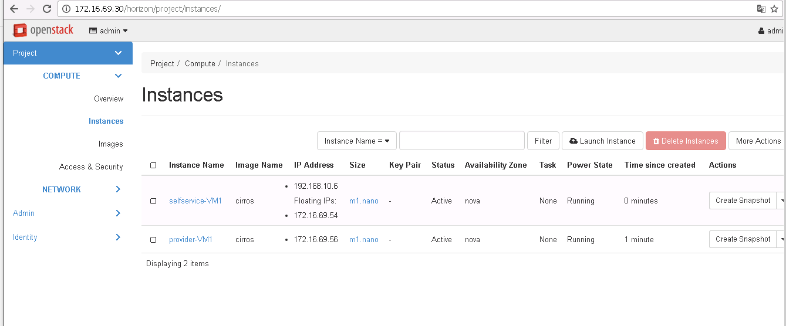

# OpenStack Newton note

##  Topology





## requirement_hardware


##  ALL node
- Download git & scripts 

	```sh
	apt-get -y update && apt-get -y install git 

	git clone https://github.com/congto/OpenStack-Newton-Scripts.git

	mv /root/OpenStack-Newton-Scripts/OPS-U16/scripts/ /root/

	rm -rf  /root/OpenStack-Newton-Scripts/

	cd scripts

	chmod -R +x *.sh
	```

- Can you edit `config.cfg` file

##  Controller 

- SSH with `root` account and run scripts

```sh
bash setup01.sh controller
bash setup02.sh controller
bash setup03.sh controller
```

##  Compute1 

- SSH with `root` account and run scripts 

```sh
bash setup01.sh compute1
bash setup02.sh compute1
bash setup03.sh compute1
```

## Create network, VM

- On Controller node, run 

```sh
bash create-vm.sh
```

## Login dashboad 

- Dashboard: `172.16.69.30/horizon`
- User : `admin/Welcome123`

## Check
### Check by command or dashboard



